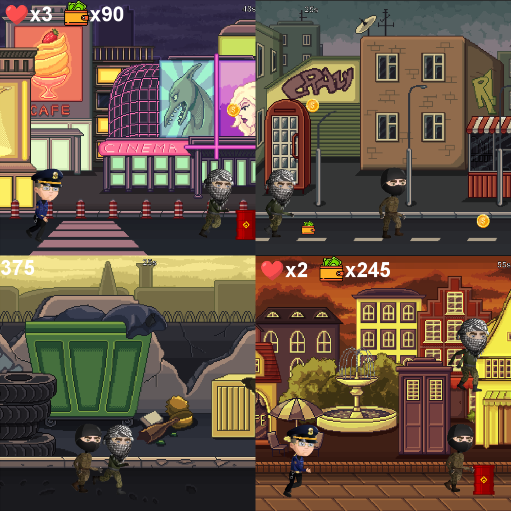

# 🕵️‍♂️ Thief Adventure – Greenfoot Game
Thief Adventure adalah game 2D petualangan seru yang dibuat menggunakan Greenfoot, sebuah lingkungan pengembangan berbasis Java yang dirancang untuk pendidikan dan pemula dalam pemrograman game. Dalam game ini, pemain berperan sebagai seorang pencuri yang harus menghindari polisi, mengumpulkan uang, dan bertahan hidup selama mungkin.

## 🎮 Gameplay
- 🏃‍♂️ Karakter utama: Pencuri yang bisa bergerak dan melompat.
- 🚓 Musuh: Polisi yang akan mengejar dan menangkap pemain.
- 💰 Power-up: Mengumpulkan uang dan hati untuk menambah skor dan nyawa.
- 🎯 Tujuan: Bertahan hidup dan mengumpulkan skor tertinggi.

## 📷 Cuplikan

## 🛠️ Dibuat Dengan
- 🧰 Greenfoot – IDE Java untuk membuat game berbasis objek
- ☕ Java – Bahasa pemrograman utama
- 🎨 Gambar dan animasi – Digunakan untuk karakter, latar belakang, dan efek

## 📁 Struktur Proyek
thief-adventure/
├── images/               # Aset gambar (karakter, background, dll.)
├── sounds/               # Aset suara
├── *.java                # Kode sumber aktor dan dunia (World, Actor)
├── *.class               # File hasil kompilasi
├── *.gfar                # File arsip proyek Greenfoot
└── README.md             # Dokumentasi proyek

## 🚀 Cara Menjalankan Game
1. Instal Greenfoot
2. Download Greenfoot dari: https://www.greenfoot.org/download
3. Buka Proyek
4. Buka Greenfoot.
5. Pilih menu Project > Open Project.
6. Arahkan ke folder thief-adventure.
7. Jalankan Game
8. Klik tombol Compile.
9. Tekan tombol Run untuk mulai bermain.

## 💡 Fitur-Fitur Kode
- Thief.java – Aktor utama pemain (pencuri)
- Police.java – Musuh yang mengejar pemain
- Dollar.java, Heart.java – Objek collectible
- MyWorld.java – Dunia utama tempat game berlangsung
- Hint.java, GameOver.java – Layar petunjuk dan akhir game

## 👥 Pembuat
Dibuat oleh: Lantera Meunasah
Platform: Greenfoot
Tahun: 2025

